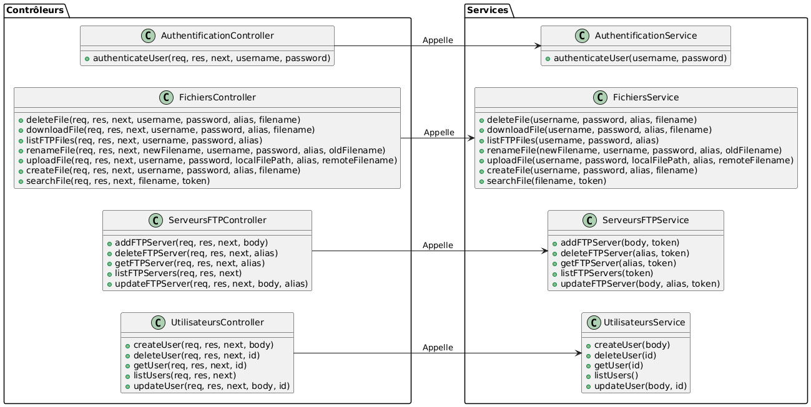

# FlopBox API - Documentation Swagger

## Présentation
FlopBox est une API REST permettant la gestion centralisée des fichiers sur des serveurs FTP tiers. Cette API facilite l'interaction avec plusieurs serveurs FTP en offrant une interface unifiée.

---

## Instructions de build et d'exécution

### Construction du projet
Le projet est structuré selon le format standard Apache Maven. Pour construire l'application :
```bash
  npm install
```

### Lancer les tests
Pour exécuter les tests unitaires, utilisez la commande suivante :
```bash
  npm test
```

### Générer la documentation
Pour générer la documentation Jsdoc, utilisez la commande suivante :
```bash
  jsdoc ./service  
```

### Lancer le projet
Pour exécuter serverFTP, utilisez la commande suivante :
```bash
  npm start
```

---

## Fonctionnalités principales

### Gestion de l'authentification

- **Connexion** : `POST /v2/auth`

### Gestion des utilisateurs
- **Lister les utilisateurs** : `GET /v2/users`
- **Créer un utilisateur** : `POST /v2/users`
- **Récupérer un utilisateur par ID** : `GET /v2/users/{id}`
- **Mettre à jour un utilisateur** : `PUT /v2/users/{id}`
- **Supprimer un utilisateur** : `DELETE /v2/users/{id}`

### Gestion des serveurs FTP
- **Ajouter un serveur FTP** : `POST /v2/ftp-servers`
- **Lister les serveurs FTP** : `GET /v2/ftp-servers`
- **Récupérer un serveur FTP par alias** : `GET /v2/ftp-servers/{alias}`
- **Mettre à jour un serveur FTP** : `PUT /v2/ftp-servers/{alias}`
- **Supprimer un serveur FTP** : `DELETE /v2/ftp-servers/{alias}`

### Gestion des fichiers sur un serveur FTP
- **Lister les fichiers** : `GET /v2/ftp-servers/{alias}/files?username=...&password=...`
- **Upload un fichier** : `POST /v2/ftp-servers/{alias}/files/{filename}?username=...&password=...`
- **Download un fichier** : `GET /v2/ftp-servers/{alias}/files/{filename}?username=...&password=...`
- **Supprimer un fichier** : `DELETE /v2/ftp-servers/{alias}/files/{filename}?username=...&password=...`
- **Rechercher un fichier sur tous les serveurs FTP associés à un utilisateur** : `GET /v2/ftp-servers/search`
- **Créer un fichier** : `POST /v2/ftp-servers/{alias}/files/{filename}/create?username=...&password=...&filename=...`
- **Renommer un fichier** : `PUT /v2/ftp-servers/{alias}/files/{filename}/rename?username=...&password=...&filename=...&newFilename=...`

## Conclusion
FlopBox simplifie l'accès et la gestion des serveurs FTP via une API centralisée, tout en maintenant un niveau de sécurité élevé en exigeant l'authentification à chaque interaction avec un serveur FTP.

---

## Architecture

### Structure du projet

Le projet est organisé en plusieurs classes principales réparties dans différents packages. Voici un aperçu de l'architecture :

```
.
├── Curl_Commands.md
├── FlopBox-V2-description.md
├── FlopBox_servers.json
├── FlopBox_users.json
├── FtpServers
│        ├── FtpServer1
│        │       ├── README.md
│        │       ├── test.txt
│        │       ├── test2.txt
│        │       ├── test_create.txt
│        │       └── test_receiver.txt
│        ├── FtpServer2
│        │       └── test2.txt
│        ├── LocalServer
│        │       ├── local_file_sender.txt
│        │       └── test.txt
│        ├── ftpserver1.py
│        └── ftpserver2.py
├── README.md
├── api
│    └── openapi.yaml
├── controllers
│        ├── Authentification.js
│        ├── Fichiers.js
│        ├── ServeursFTP.js
│        └── Utilisateurs.js
├── index.js
├── package-lock.json
├── package.json
├── service
│        ├── AuthentificationService.js
│        ├── FichiersService.js
│        ├── ServeursFTPService.js
│        └── UtilisateursService.js
├── tests
│        ├── Authentification_Utilisateurs.test.js
│        ├── Fichiers.test.js
│        ├── ServeursFTPService.test.js
│        ├── ftp_test_dir
│        │        └── test_folder
│        └── start_ftp.py
└── utils
     └── writer.js
```

Les classes principales sont situées dans le dossier des contrôleurs et des services. Les contrôleurs gèrent les requêtes HTTP et les réponses, tandis que les services implémentent la logique métier.

voici un diagramme UML de l'architecture du projet :



Pour ce qui est des Users et des Serveurs FTP, ils sont stockés dans des fichiers JSON. Les fichiers de configuration sont stockés dans les fichiers `FlopBox_servers.json` et `FlopBox_users.json`.

---